# OpenGlass 🕶️

**Real-time AI-powered smart glasses interface**

[](https://swift.org)
[](https://developer.apple.com/ios/)
[](LICENSE)
[]()

OpenGlass connects Meta Ray-Ban smart glasses to **Gemini Live** and **OpenClaw**, turning them into a personal AI companion with eyes, ears, and hands. Stream video and audio in real-time, get intelligent responses, and execute actions across 56+ skills — all hands-free. Built as a native Swift iOS app with a flexible mode system for translation, QR scanning, object spotting, and more.

---

## Architecture

```mermaid
graph TD
    A[Meta Ray-Ban Glasses] -->|Video + Audio| B[OpenGlass iOS App]
    A2[iPhone Camera Fallback] -->|Video + Audio| B
    B --> C[Vision Pipeline\n1fps JPEG frames]
    B --> D[Audio Pipeline\n16kHz PCM]
    B --> E[Mode Router]
    C --> F[Gemini Live WebSocket]
    D --> F
    E --> F
    F --> G[Audio Response → Speaker]
    F --> H[Tool Calls → OpenClaw]
    F --> I[Transcript → Screen]
    H --> J[OpenClaw Gateway\n56+ Skills]
```



## Features

| Mode | Description |
|------|-------------|
| 🤖 **Assistant** | General-purpose AI with vision — describe scenes, read signs, remember context |
| 🌐 **Translator** | Real-time Mandarin ↔ English translation (voice + visual text) |
| 📱 **QR Scanner** | Detect and act on QR codes — open links, add contacts, trigger skills |
| 👁️ **Spotter** | Watch for specific objects/events and alert when spotted |
| 🧭 **Navigator** | Contextual navigation — read signs, find places, look up routes |
| ⚙️ **Custom** | User-defined modes with custom system instructions and tool sets |

## How It Works

1. **Capture** — Video frames from glasses (or iPhone camera) + microphone audio
2. **Stream** — Frames throttled to 1fps JPEG, audio at 16kHz PCM, both sent to Gemini Live via WebSocket
3. **Process** — Gemini analyses vision + audio, generates responses and tool calls
4. **Act** — Audio responses play through the speaker; tool calls route to OpenClaw Gateway for execution
5. **Display** — Live transcript shown on screen; results fed back into the conversation

## Getting Started

### Prerequisites

- **Xcode 15+** with Swift 5.9
- **iPhone** running iOS 17.0+ (iPhone 12 or later recommended)
- **Gemini API key** from [Google AI Studio](https://aistudio.google.com/apikey)
- **OpenClaw Gateway** running on a Mac on the same LAN
- **Meta Ray-Ban glasses** (optional — iPhone camera works as fallback)

### Build

```bash
git clone https://github.com/DarlingtonDeveloper/OpenGlass.git
cd OpenGlass
open OpenGlass.xcodeproj  # (when Xcode project is created)
```

### Configure

1. Add your Gemini API key in Settings → API Key
2. Ensure OpenClaw Gateway is running (`openclaw gateway status`)
3. Connect to the same Wi-Fi network as your Mac
4. (Optional) Pair Meta Ray-Ban glasses via Bluetooth

See [docs/SETUP.md](docs/SETUP.md) for detailed instructions.

## Project Structure

```
OpenGlass/
├── App/                  # App entry point and root view
├── Config/               # Configuration management
├── Gemini/               # Gemini Live WebSocket, session, audio
├── Vision/               # Camera capture, frame throttling, QR detection
├── Modes/                # Mode protocol, router, and built-in modes
├── OpenClaw/             # Gateway bridge and tool call routing
├── UI/                   # SwiftUI views
└── docs/                 # Documentation
```

## Roadmap

| Phase | Focus | Timeline |
|-------|-------|----------|
| 1 | Foundation — app shell, camera, audio capture | Week 1-2 |
| 2 | Gemini Integration — WebSocket, streaming, tool calls | Week 3-4 |
| 3 | OpenClaw Bridge — gateway discovery, skill invocation | Week 5 |
| 4 | Mode System — all built-in modes, voice switching | Week 6-7 |
| 5 | Polish & Glasses — DAT SDK, glasses UI, optimization | Week 8-10 |
| 6 | Advanced Features — navigator, custom modes, widgets | Ongoing |

See [SPEC.md](SPEC.md) for full specification.

## Acknowledgments

- **[VisionClaw](https://github.com/sseanliu/VisionClaw)** by Sean Liu — the inspiration and proof-of-concept for Gemini Live + OpenClaw on smart glasses
- **[Gemini Multimodal Live API](https://ai.google.dev/gemini-api/docs/multimodal-live)** — Google's real-time multimodal streaming API
- **[OpenClaw](https://openclaw.app)** — AI agent gateway powering the 56+ skill integrations
- **[Meta DAT SDK](https://developers.meta.com/horizon/documentation/dat/dat-overview)** — Direct Audio Transfer SDK for Ray-Ban Meta glasses

## License

[MIT](LICENSE) © 2026 Mike Darlington
